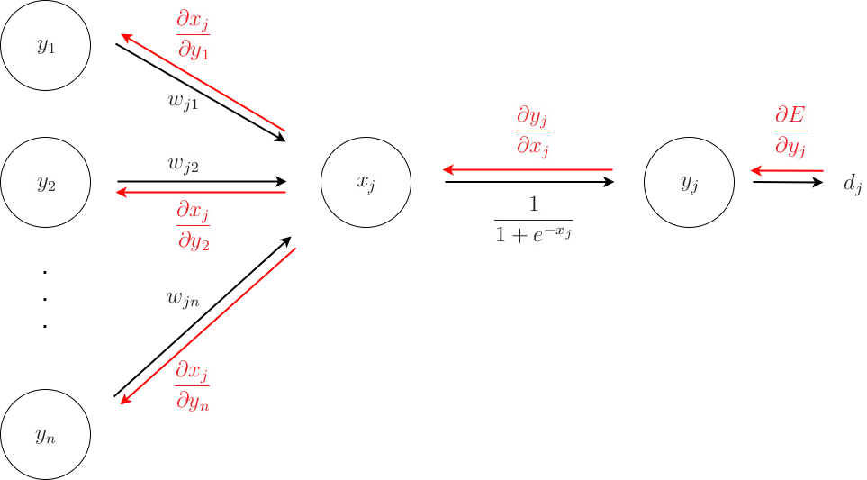

## 0. Paper

&nbsp;Rumelhart, D. E., Hinton, G. E., & Williams, R. J. (1986). Learning representations by back-propagating errors. nature, 323(6088), 533-536.
 

## 1. Introduction

&nbsp;다층 신경망(MLP)의 등장으로 은닉층(hidden layer) 내 파라미터의 수가 급등하였습니다.   
이러한 많은 파라미터를 효과적으로 학습시키기 위해, 저자들은 역전파(Backpropagation) 알고리즘을 제안하였습니다.

## 2. Back Propagation

&nbsp;아래 그림을 기반으로, 논문에 기술된 역전파(Backpropagation) 알고리즘의 수식을 이해하면 됩니다.  
수식 (5) 이후, 해당 논문의 핵심인 연쇄법칙(chain rule)과 역방향(Backward) 연산이 이뤄집니다.

<figure class="Backpropagation">
    
    

        <figcaption> Back propagation 설명 </figcaption>
    

</figure>
 

|(1) $x_j$ = $\sum_{i} y_i w_{ji}$    (2) $y_j$ = ${1} \over {1+\mathrm{e}^{-x_j}}$    (3) $E$ = $1 \over 2$  $\sum_{c} \sum_{j}$ $(y_{j,c} - d_{j,c})^2$    (4) $\frac {\partial E} {\partial {y_j}} = y_j - d_j$    (5) $\frac {\partial E} {\partial {x_j}} = \frac {\partial E} {\partial {y_j}} \frac {\partial {y_j}}{\partial {x_j}} = \frac {\partial E} {\partial {y_j}} y_j (1-y_j)$ &nbsp; : &nbsp; 수식 (2) 참고    (6) $\frac {\partial E} {\partial w_{ji}} = \frac {\partial E} {\partial x_{j}} \frac {\partial x_{j}} {\partial w_{ji}} = \frac {\partial E} {\partial x_{j}} y_i$ &nbsp; : &nbsp; 수식 (1) 참고    (7) $\frac {\partial E} {\partial y_{i}} = \frac {\partial E} {\partial x_j} \frac {\partial x_j} {\partial y_i} = \sum_{j} \frac {\partial E} {\partial x_j} w_{ji}$ &nbsp; : &nbsp; 수식 (1) 참고    (8) $\Delta {w} = -\epsilon \frac {\partial E}{\partial w}$ &nbsp; : &nbsp; 가중치 업데이트를 위해 사용될 편미분 값

## 3. Gradient Descent

&nbsp;위와 같이 역전파(Backpropagation)를 통해 얻은 편미분 값을 경사하강법에 적용하면, 다음과 같은 수식이 도출됩니다.

| $w = w - \epsilon \frac {\partial E}{\partial w} $ ( $\epsilon$ : learning rate / $\frac {\partial E}{\partial w}$ : 에러에 대한 가중치의 편미분 값 ) 

## 4. Appendix

| (1) 해당 논문은 기본적으로 순방향 신경망(feed forward network)을 가정합니다.    (2) 해당 논문에서는 은닉층(hidden layer)을 특징 분석기(feature analysers)로 비유하는데,   &nbsp; &nbsp; &nbsp; 그 이유는 입력층(input layer)과 출력층(output layer) 사이에서 중요한 특징을 추출하여 결과를 예측하기 때문입니다.    (3) 역전파(Back propagation)을 이용한 경사하강법 방식은 전역 극소점(global minimum)을 보장하지 않습니다.   &nbsp; &nbsp; &nbsp; 하지만, 실험적으로는 지역 극소점(local minimum)에 빠지는 경우는 극히 드뭅니다.